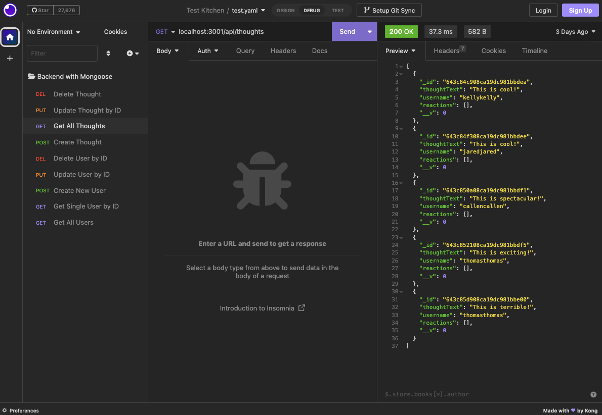

# Back-End-With-Mongoose

## Table of Contents

* [Description](#description)
* [Screenshot](#screenshot)
* [Video Walkthrough](#video-walkthrough)
* [Installation](#installation)
* [Usage Instructions](#usage-instructions)
* [Technologies Used](#technologies-used)
* [License](#license)
* [Credits](#credits)
 

## Description  

This is the backend of a social network where users can share their thoughts and with others. Creates, reads, updates, and deletes users posts. This app follows the MVC paradigm, uses Express.js, and Mongoose as the ODM. 

## Screenshot  

## Video Walkthrough

[Click here](assets/images/screenshot.png) to view video walkthrough of application.  

## Installation

Please clone the repository from Github.    
Type `npm i` in the command line to install necessary dependencies. 
  

## Usage instrutions

Run the following command in the root directory of your project to start the server:
  
`node server.js`

## Technologies Used    

* Node.js
* Express.js
* Mongoose
* Dotenv
* Bootstrap for CSS framework
* Insomina for route testing

## License

MIT License

## Credits

Guidance and support for this project was given by a UT bootcamp tutor, CodeAcademy Mongoose/MongoDB courses, and Colt Steele's Web Developer Bootcamp on Udemy. 